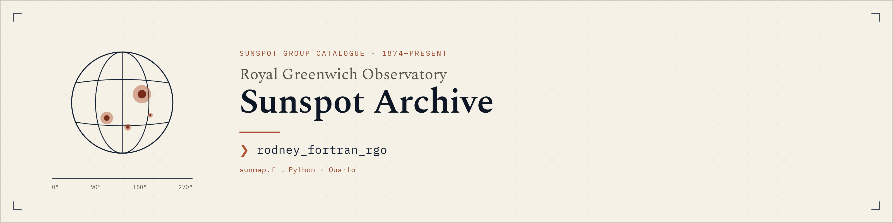

# rodney_fortran_rgo

Here’s the MySQL dump (to .csv)  Maybe you can load these data into MarioDB ?   At one time I loaded all these files into MySQL.  
Descriptions are here:  https://solarscience.msfc.nasa.gov/greenwch.shtml
Here’s some other RGO data for different months and years.   I will try to remember where I put these old data pulls; somewhere in MySQL:    
If that weren’t enough, here’s another fortran file that tries to “map’ the output:    

---

## Notes

### Data files

- **`rgo_data-all.csv`** — the master table (15 columns), one row per sunspot group observation. Its column layout matches `rgo_header.rtf`'s fixed-width record description exactly (see below).
- **`rgo_data.sql`** — a MySQL query that pulls a 6-column subset (`CSG, day, CWSA, LNS, CLD, CUA`) from the master table for a given date range, exporting to CSV via `INTO OUTFILE`. Only the query for the `5809` (1958–1958, month 9) subset is saved in the repo.
- **`rgo_data_0508.csv/.prn`, `rgo_data_0808.csv/.prn`, `rgo_data_5809.csv/.prn`, `rgo_data_8008.prn`** — outputs of that query (or ones like it) for different date ranges. These are **not** full records — they're the 6-column derived subset, not the 15-field layout in `rgo_header.rtf`.

### Record layout (`rgo_header.rtf`)

The RTF layout describes `rgo_data-all.csv`'s 15 columns (`date,time,CSG,sufix,CGT,NOAA,CUA,OWSA,CUA,CWSA,DCSD,PAHN,CLD,LNS,CMD`) and they line up positionally field-for-field, era-dependent columns (Greenwich vs. NOAA/USAF numbering, group type) included. The RTF gives no abbreviation for the "observed umbral area" field (cols 26–29); per Rodney, there's no `QUA` column — that field is also `CUA`, so the CSV has two same-named `CUA` columns (observed umbral area at position 7, corrected umbral area at position 9). Everything else (`OWSA`, `CWSA`, `DCSD`, `PAHN`, `CLD`, `LNS`, `CMD`) matches the RTF description directly.

### `sunmap.f`

Legacy interactive Fortran 77 that simulates sunspot pore evolution (Boots et al., *Science*, 6 Feb 2004) from Umbra/Penumbra structure. Four distinct pieces:

1. **Main program (`SUNMAP`)** — reads sunspot records (`ICSG, iday, ICWSA, ILNS, ICLD`) from `map_data.PRN` in batches, computes derived quantities via the EXPO chain, writes `SUN.CSV`. This read format is the same shape as the derived `rgo_data_*.prn` files above, minus their trailing CUA column (recomputed rather than trusted).
2. **`EXPO` + `ENERGY`/`MASS`/`JTEMP`/`E2`/`CPI`** — the transcendental formula chain (log → arctan → exp) implementing the Boots et al. curve-fit, producing an evolution estimate `F`/`SICE`.
3. **`ZCELLS` + `SPUR`** — a separate SEIR-style epidemiological simulation over 8 "polygons," depending on external state files (`POLYPARA.DAT`, `TIMENEW.DAT`, `TIMEOLD.DAT`) not present in this repo.
4. **`moves` + `ran2`** — a legacy Numerical-Recipes-style PRNG feeding `SPUR`.

Issues found while reading the source (relevant to any future work on it):

- `RNSTNR`, called for the "random data" mode, is not defined anywhere in this file or the repo.
- `ZCELLS` opens `TIMENEW.DAT`/`TIMEOLD.DAT` with `STATUS='OLD'` in both its branches — it never actually creates them from scratch despite being the routine that's supposed to produce them.
- `WRITE(*,*) NREC,N,LABEL` (line 38) fires before those variables are ever read — the intended `READ` is commented out.
- `CUA = SQRT(ILNS*ICLD)/ICWSA` divides by `ICWSA`, which is 0 in real data rows, and takes `sqrt` of a product that can go negative since `ILNS` (latitude) is signed.
- `SPUR`'s convergence loop (`300 CONTINUE ... GOTO 300`) has no iteration cap.
- The `EXPO` header comment's documented `S2` formula doesn't match what the code actually computes — see the Python port notes below.

### Python/Quarto port

`python/` contains a port of the main `SUNMAP` record loop + `EXPO` chain (scope decision: `SPUR`/`ZCELLS` and the `RNSTNR` random-data mode are excluded — see `python/sunmap/model.py` docstring for why and how the `ZCELLS` call site is stubbed).

- `python/sunmap/expo.py` — `EXPO`, `ENERGY`, `MASS`, `JTEMP`, `E2`, `CPI`, ported function-for-function. Preserves a real bug caught during translation: Fortran's left-to-right `*`/`/` evaluation means `S2 = (3*DSQRT(ESQR)/4*PI*M*freq)**KT` is **not** divided by `(4*PI*M*freq)`, contrary to what the header comment's formula implies.
- `python/sunmap/model.py` — the main record-processing loop (`SunmapParams`, `SunspotRecord`, `process_batch`). Preserves known quirks (the `REMQ` carry-over on odd `IREC`, the dead `EXPO()` call whose result goes unused in the `IREC<=K` branch) rather than silently fixing them, and adds explicit NaN + warning guards for divisions/`sqrt` calls that would raise in Python but silently NaN/Inf or trap in Fortran.
- `python/sunmap/io.py` — reads `rgo_data_*.prn` files into `SunspotRecord`s.
- `python/sunmap_report.qmd` — Quarto notebook: YAML params replace the original's interactive `READ(*,*)` prompts, runs the model against `rgo_data_0508.prn`, plots `SUSQI`/evolution/`CUA`.

PR: https://github.com/davidjayjackson/rodney_fortran_rgo/pull/1
